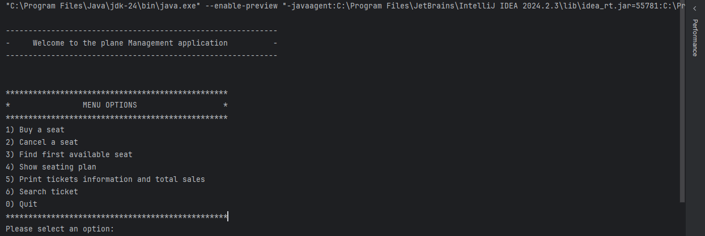
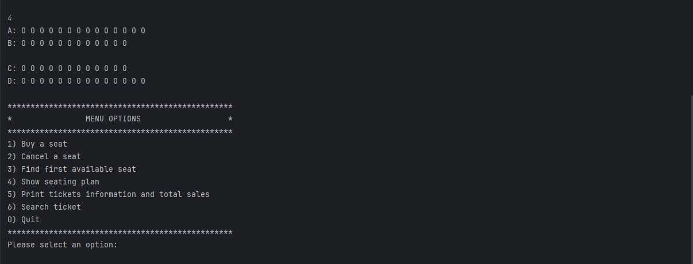
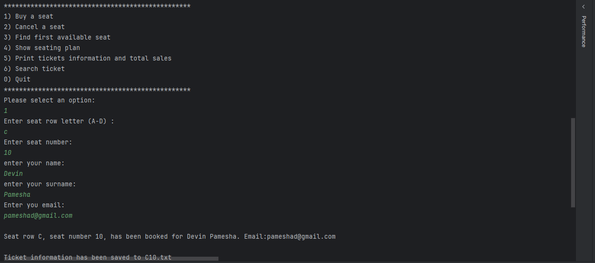
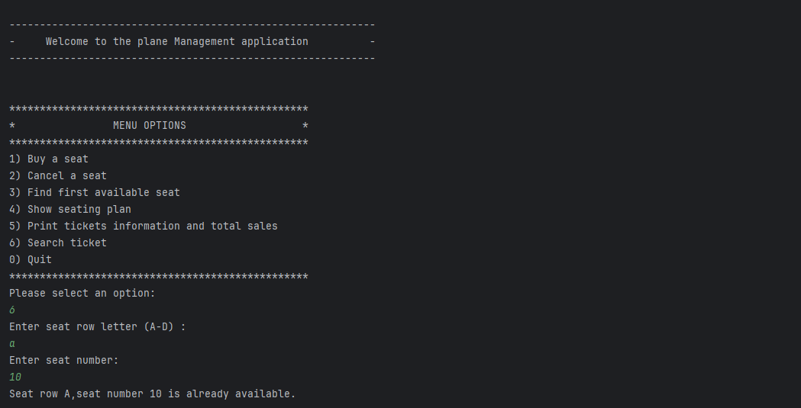

# 🌐 Plane Ticket Booking Website (CLI Project)

A Java-based command-line interface (CLI) application designed to simulate a basic airline seat reservation system. Implemented core Object-Oriented Programming (OOP) principles including encapsulation and modular design. The system allows users to book, cancel, view, and sort seat reservations in a 2D arraybased seating model, with proper input
validation and exception handling.

Technologies: Java, OOP, Exception
Handling, Arrays, CLI 

---

## 🖼️ CLI Screenshot
#### 🧾 Menu Options

#### 🧾 Show Seating Plan

#### 🧾 Buy a Seats

#### 🧾 Print Tickets Information and Total Sales

#### 🧾 Search Ticket



## 📌 Features

1) Buy a seat
2) Cancel a seat
3) Find first available seat
4) Show seating plan
5) Print tickets information and total sales
6) Search ticket
0) Quit

---

## 🚀 How to Run

1. **Clone the repository**
   ```bash
   git clone https://github.com/Devin2002/plane-ticket-booking-html-css.git
